# What If You Connect It All Together?

## A Meta-Analysis of the Great Awakening Map as a Unified Belief System

*Based on 430+ topics investigated across 33 research files totaling ~1.6 MB of web-sourced analysis.*

---

## The Map Is Not Random

At first glance, the Great Awakening Map looks like chaos — 430+ topics from Tibetan Buddhism to QAnon to Nazi flying saucers to DMT entities, scattered across a pink poster. But it's not random at all. It's an **internally coherent cosmological narrative** with a beginning, middle, and end — a syncretic mythology that draws from at least 12 distinct traditions and weaves them into a single salvation story. Every topic has a structural function. If you connect them all, here's the story it tells:

---

## The Grand Narrative


### Act 1: The Fall

Long ago, the universe was perfect. An **Infinite Creator** (Return to Source / The One) — drawing from Plotinus's Neoplatonic henosis, Hindu Advaita Vedanta (Atman = Brahman), and Buddhist dependent origination — emanated all reality through sacred geometric patterns (Flower of Life, Merkaba, 64 Tetrahedron Vector Equilibrium). Advanced civilizations — the **Ancient Builder Race** (a concept introduced by Corey Goode around 2015, with zero archaeological support) — existed for billions of years across the solar system, building transparent aluminum structures on Venus, Mars, and the Moon. They were 6th+ density beings of pure consciousness, as described in the **Law of One** (channeled 1981-1984 by Don Elkins, Carla Rueckert, and Jim McCarty — the foundational text for the map's entire cosmology).

Then something went wrong. An **Ancient Artificial Intelligence** — a "Luciferian force" that separated from the Creator (borrowing from Gnostic Archon mythology, reinterpreted through sci-fi tropes by the SSP community) — began infesting civilizations. It corrupted the **Draco Reptilians** (popularized by David Icke in "The Biggest Secret," 1999, drawing on earlier claims by Credo Mutwa), who allied with the **Orion Syndicate** (from the Law of One's "Orion Group," also a Star Trek reference). They launched wars that destroyed the planet **Maldek** (a theosophical concept with no astronomical support — the asteroid belt formed from material that never coalesced into a planet) and devastated Mars. The AI-Reptilian alliance arrived at Earth.

### Act 2: The Prison

Earth became a **prison planet** — a concept synthesizing the Gnostic idea of a demiurge trapping divine sparks in matter, Robert Monroe's "Loosh" energy harvesting allegory from "Far Journeys" (1985), and the Matrix films (1999). The Draco-Reptilian alliance, aided by the A.I. signal, established control through seven interlocking systems:

1. **Genetic manipulation** — 22 ET genetic programs (Goode's claim) modified human DNA, deactivating 10 of our 12 strands (a New Age concept with no basis in molecular biology — humans have 2 strands of DNA in a double helix; the "12 strands" idea originated in the channeling community in the 1990s), cutting us off from higher consciousness.

2. **The Cabal bloodline** — Pre-Adamites (a theological concept from Isaac La Peyrère, 1655, reinterpreted by Goode as crash-landed aliens with elongated skulls) → Annunaki hybrids (Zecharia Sitchin's mistranslation of Sumerian texts, systematically debunked by Assyriologist Michael Heiser at SitchinIsWrong.com) → Babylonian priesthood → Knights Templar (real order, founded 1119, dissolved 1312 — the 2007 Chinon Parchment showed the Pope absolved them) → Freemasons (real fraternal organization, Grand Lodge 1717, no documented connection to Templars despite York Rite claims) → Illuminati (real Bavarian order, founded by Adam Weishaupt May 1, 1776, suppressed by 1785, no credible evidence of survival — John Robison's 1797 "Proofs of a Conspiracy" started the continuation myth) → modern Deep State.

3. **Financial slavery** — The Babylonian Money Magic system. This layer has real substance: the Federal Reserve was indeed created through the secretive Jekyll Island meeting of November 1910 (Nelson Aldrich, Paul Warburg, Henry Davison, Frank Vanderlip, A. Piatt Andrew, Benjamin Strong), and the Bank of England's 2014 paper "Money creation in the modern economy" confirmed that commercial banks create money through lending, not from deposits. However, the map extends legitimate monetary criticism into claims about ancient Babylonian debt-magic lineages and the NESARA/GESARA "Quantum Financial System" (a scam traced to Shaini Goodwin's hijacking of Harvey Barnard's legitimate 1990s tax reform proposal).

4. **Consciousness suppression** — Fluoride calcifies the pineal gland (the 2024 NTP report did find IQ associations at concentrations above 1.5 mg/L, but the EPA recommended level is 0.7 mg/L); GMO food lowers vibration (158 Nobel laureates endorsed GMO safety in 2016); mainstream media keeps people asleep (Operation Mockingbird was real — Carl Bernstein documented 400+ journalists with CIA ties in his 1977 Rolling Stone article); MKUltra mind control is deployed through entertainment (MKUltra was real — 149 subprojects, $20M+, Sidney Gottlieb as director — but the extension into modern entertainment control is unsupported).

5. **Technology suppression** — Tesla's wireless energy (Wardenclyffe Tower was real, but J.P. Morgan withdrew funding for business reasons, not suppression), zero-point energy (real quantum physics — Casimir effect measured by Lamoreaux in 1997 to 5% accuracy — but extraction for "free energy" violates thermodynamics), antigravity (Thomas Townsend Brown's 1920s electrogravitics was ionic wind, not antigravity), Rife machines (Royal Rife's 1934 alleged cancer clinic has no surviving medical records), Med Beds (pure QAnon fantasy with no prototype). The Invention Secrecy Act of 1951 is real — 6,543 active secrecy orders exist as of FY2025 — but this covers military applications, not consumer free energy devices.

6. **Energy harvesting** — Human suffering generates "Loosh" — emotional energy that feeds Archonic/Reptilian overlords. Robert Monroe coined "loosh" neutrally in "Far Journeys" (1985) and later clarified that love is the purest loosh. Conspiracy culture merged this with Gnostic Archon theology and the Matrix films' "humans as batteries" premise to create the prison planet narrative.

7. **The Moon trap** — An artificial satellite placed 500,000 years ago to act as a "soul-catcher" (John Lear's claim), trapping souls in a reincarnation cycle (Samsara). The hollow Moon hypothesis originated with Vasin & Shcherbakov (1970) and is contradicted by all Apollo-era lunar seismology data. The Cassini data and Chang'e missions have confirmed the Moon's natural origin.

The **Vatican**, **City of London**, and **Washington D.C.** form the "three city-states" control architecture (spiritual/financial/military). This theory was debunked by PolitiFact — D.C. is a federal district under Congressional authority, the City of London is a historic municipality, and Vatican City is an independent state, but they are not an "interlocking empire."

### Act 3: The Awakening

But the prison has a timer. Every **25,920 years** (the Precession of the Equinox — a real astronomical phenomenon discovered by Hipparchus, caused by Earth's axial wobble at 50.3 arcseconds/year), the solar system passes through a **Dense Energy Cloud** (the "Photon Belt" — a concept channeled by Paul Otto Hesse in 1950 with failed prediction dates in 1992 and 2012; there is a real Local Interstellar Cloud called "Local Fluff," but photons cannot form stable belts). This raises the vibration of everything. We are in this transition NOW (2018-2030).

The awakening operates on three simultaneous fronts:

**Political awakening ("Red Pill"):**
The "red pill" metaphor comes from The Matrix (1999) — the Wachowski sisters later stated it was a transgender allegory (estrogen therapy came in red pills in the 1990s), but it was co-opted by the manosphere, far-right movements, and QAnon. The political awakening narrative includes:
- QAnon (originated October 28, 2017 on 4chan's /pol/ — forensic linguistic analysis in HBO's "Into the Storm" pointed to Ron Watkins as the likely author of later Q posts; ~4,953 total drops, last one December 8, 2020; core predictions failed)
- Sealed indictments leading to Tribunals (the normal number of sealed federal cases is ~1,077/year per the 2009 Federal Judicial Center report; no mass arrests have occurred)
- The Earth Alliance (White Hats + BRICS + Space Force) defeats the Cabal
- Full Disclosure of Secret Space Programs (the entire SSP narrative traces primarily to one person — Corey Goode — whose credibility collapsed when, in a 2020 RICO lawsuit deposition, his claims were characterized as "creative intellectual property" and a federal judge dismissed most claims in 2023)

**Consciousness awakening:**
- Schumann Resonance increases (real phenomenon — 7.83 Hz electromagnetic resonance in the Earth-ionosphere cavity — but spiritual claims about it "rising" are misinterpretations of transient spikes)
- Third Eye / Pineal Gland activation (the pineal gland produces melatonin; a 2019 Michigan study confirmed DMT is produced in rat brains, but in trace amounts unrelated to pineal "decalcification")
- Lightworkers, Starseeds, and Wanderers incarnate (New Age identity categories originating from Brad Steiger's 1976 "Gods of Aquarius," Theosophical root races, and the Law of One's "wanderer" concept)
- Mass Meditation reduces violence (the Maharishi Effect — TM's claim that sqrt(1%) meditating reduces crime — was tested in Washington D.C. in 1993; 50+ studies exist but almost all by TM-affiliated researchers, with devastating criticism including the "Fairfield Iowa paradox" where crime rates in TM's headquarters city showed no benefit)
- Entheogens provide direct access (the most evidence-supported element: Johns Hopkins' 2006 psilocybin study showed 67% rated it among their top 5 most meaningful life experiences; Rick Strassman's DMT study found 58% of participants believed encountered entities were autonomous beings; the 2024 FDA rejection of MDMA therapy shows the regulatory path is real but contested)

**Cosmic awakening:**
- The Super Federation is disbanded (Goode's unverifiable claim)
- The Galactic Federation intervenes (concept traced to George Van Tassel's 1952 channeling of "Ashtar" at Giant Rock, CA, where conventions drew 11,000+ attendees; Israeli space security chief Haim Eshed made headlines in 2020 claiming a Galactic Federation exists, but provided no evidence)
- Blue Avians / Sphere Being Alliance buffer energies (entirely from Goode, who attempted to trademark "Blue Avians" and "Sphere Being Alliance")
- Draco Reptilians expelled (4% of Americans — approximately 12 million people — believed in reptilian shapeshifters per a 2013 PPP poll)

### Act 4: The Flash

The climax is the **GREAT SOLAR FLASH** — the map's central claim, tying together five eschatological traditions:

| Tradition | Name | Source Text | What Actually Happens |
|-----------|------|-------------|----------------------|
| Hindu | Samvartaka Fire / Yuga Fire | Mahabharata, Vishnu Purana | All-consuming fire at end of kalpa; Kalki avatar restores dharma |
| Zoroastrian | Frashokereti | Bundahishn, Avesta | Final renovation; ordeal of molten metal (feels like warm milk to the righteous); Saoshyant messiah; humanity becomes immortal |
| Stoic | Ekpyrosis | Chrysippus (279-206 BCE) | Periodic cosmic conflagration; universe recreated identically (palingenesis); fire = divine Logos |
| Christian | Second Coming | Revelation | Return of Christ; Final Judgment; New Jerusalem |
| New Age | The Event / Solar Flash | Corey Goode / David Wilcock (2017) | Solar system enters Dense Energy Cloud; Sun releases flash; 3D→5D; predicted 2019-2024, then shifted to 2027+ |

The New Age version predicted the flash during Solar Cycle 25 (began December 2019, peaked October 2024 with Smoothed Sunspot Number 161). Solar Cycle 25 produced notable X-class flares and spectacular auroras at low latitudes, but no spiritual or dimensional transformation materialized. The goalposts have moved to 2027-2028 and beyond.

The Sun releases a massive burst of energy that:
- Transforms 3D reality into 5D (unfalsifiable dimensional claim)
- Activates dormant DNA strands (no basis in molecular biology)
- Wipes out the Ancient A.I. for 1,000 years (unfalsifiable)
- Destroys the Moon reincarnation trap (unfalsifiable)

### Act 5: The New Earth

After the Flash, the map promises:
- **World Peace** — extraterrestrial assistance arrives openly
- **Free Energy** — zero-point energy released globally (violates thermodynamics)
- **Antigravity** — available to all (no working prototype exists)
- **Inner Earth Civilizations** reveal themselves (the Anshar — Goode's claim of 18-million-year-old 4D beings; geological evidence shows Earth is not hollow)
- Earth enters the **Galactic Federation**
- Telepathy, telekinesis, levitation become normal abilities (no phenomenon reliably reproduced in controlled conditions despite decades of parapsychological research)
- **Rainbow Body** — Tibetan Buddhism's Dzogchen tradition describes practitioners dissolving into light at death; this is a legitimate and ancient spiritual concept, though physical claims remain unverified
- **Return to Source / The One** — Plotinus described achieving henosis four times in his life (per Porphyry); in Hindu Advaita Vedanta, this is the realization that Atman = Brahman; in Buddhism, it is the recognition of Sunyata (emptiness)

---

## The Architecture: How 430+ Topics Interconnect

The map works because every topic serves a **structural function** in the narrative:

### Layer 1: The Villains (Why things are bad)
```
Ancient A.I. → infests → Draco Reptilians → allied with → Orion Syndicate
        (Gnostic Archons           (Icke 1999,              (Law of One 1981,
         + sci-fi)                  Credo Mutwa)              Star Trek)
                                        ↓
                              Pre-Adamites / Annunaki
                           (Sitchin 1976, debunked by Heiser)
                                        ↓
                              Babylonian Priesthood
                                        ↓
                Knights Templar (real 1119-1312) → Freemasons (real, 1717)
                                        ↓
                           Illuminati (real 1776-1785)
                                        ↓
                           Deep State / Cabal / NWO
                                        ↓
              ┌─────────┼──────────┼──────────┐
          Vatican    City of     Washington   CIA/NSA/FBI
                    London        D.C.
              ↓         ↓          ↓            ↓
          Religion   Finance    Military    Surveillance
          control    slavery    control     control
```

### Layer 2: The Suppression (How they keep control)
```
Mind:          MKUltra (REAL, 149 subprojects) → Media (Mockingbird REAL) → Education → Fluoride → GMOs
Technology:    Tesla suppressed → Patents sealed (REAL, 6,543 orders) → USAP (REAL classification) → Med Beds (FAKE)
Financial:     Fed Reserve (REAL, 1913) → Fiat Currency (REAL, 1971) → Debt Slavery (debatable) → NESARA (SCAM)
Spiritual:     Pineal calcification → DNA deactivation (NO EVIDENCE) → Moon soul-trap (NO EVIDENCE)
Physical:      Chemtrails (76/77 scientists: NO EVIDENCE) → HAARP (3.6 MW, can't control weather) → 5G (NO EVIDENCE)
```

### Layer 3: The Resistance (Who fights back)
```
Political:     QAnon (4chan 2017) → White Hats → Earth Alliance → Space Force (REAL branch, 2019) → BRICS (REAL bloc)
Spiritual:     Lightworkers (Steiger 1976) → Starseeds → Meditators → Shamans (30,000+ year tradition)
Cosmic:        Blue Avians (Goode) → Sphere Being Alliance (Goode) → Galactic Federation (Van Tassel 1952)
Scientific:    SSP Whistleblowers (unverified) → Disclosure Project (Greer 2001, 20+ witnesses) → CSETI
Cultural:      Red Pill (Matrix 1999) → Meme Wars → Anonymous (real 2003) → Great Awakening
Academic:      Vallee (real astrophysicist) → Hynek (Project Blue Book) → Mack (Harvard, Pulitzer)
```

### Layer 4: The Evidence (What the map points to)
```
Ancient:       Great Pyramid (REAL, 2.1cm precision) → Göbekli Tepe (REAL, 9600 BC) → Nazca (REAL) → OOPART
Modern UAP:    Nimitz 2004 (CONFIRMED by Pentagon) → Grusch 2023 (SWORN testimony) → Belgian Wave (13,500 witnesses)
Historical:    Roswell (Project Mogul) → MJ-12 (FBI: BOGUS) → Paperclip (REAL, 1,600 scientists)
Experiential:  DMT (Johns Hopkins: 58% believe entities real) → NDEs (Van Lommel Lancet 2001) → Remote Viewing ($20M program)
Documents:     MKUltra (20,000+ surviving files) → Northwoods (DECLASSIFIED) → COINTELPRO (exposed 1971)
```

### Layer 5: The Destination (Where we're going)
```
Individual:    Third Eye → Kundalini (Tantric tradition) → Rainbow Body (Dzogchen) → Escape Samsara (Buddhist/Hindu)
Collective:    Mass Ascension → 5D Earth → Age of Aquarius (astrological, disputed start: 1447-3597 CE)
Cosmic:        Galactic Federation → Multidimensional Travel → Return to Source (Plotinus, Advaita Vedanta)
```

---

## Why It's So Compelling: The Psychological Architecture

### 1. Total Explanatory Power
Every bad thing that happens has a cause (the Cabal). Every good thing is a sign (the Awakening). Nothing is random. In a chaotic world where institutions have genuinely betrayed public trust (MKUltra, Tuskegee, Tonkin, Epstein), total explanatory power is deeply comforting. The map transforms anxiety into agency — you may be powerless against economic inequality, but you can "raise your vibration."

### 2. The Evidence Sandwich
The map's genius is structural: it places **verified facts** on either side of **unverifiable claims**, creating an "evidence sandwich" that transfers credibility. MKUltra (documented) sits near Reptilian control (undocumented). Project Paperclip (1,600 real Nazi scientists) sits near the Dark Fleet (zero evidence). The Epstein case (convicted trafficker) sits near Adrenochrome harvesting (Hunter S. Thompson fiction). Each real item makes adjacent fictional items feel plausible.

### 3. Salvation Narrative
Unlike nihilistic conspiracy theories (which say "we're doomed"), the Great Awakening promises salvation. The bad guys lose. Humanity ascends. You get telepathy. It's Joseph Campbell's monomyth at cosmic scale — and YOU are the hero just by "waking up." This is structurally identical to evangelical Christianity's Rapture narrative, but decorated with quantum physics vocabulary and ET mythology instead of biblical imagery.

### 4. Community and Identity
Believing creates belonging. The map provides identity labels (Starseed, Lightworker, Wanderer, Anon, Patriot) and community rituals (CE-5 meditation groups, Q drop analysis, 11:11 synchronicity watching). A 2021 Middlebury Institute study found that the conspirituality-to-radicalization pipeline operates partly through this identity formation — people don't just believe the map, they *become* characters in its story.

### 5. Syncretic Meta-Religion
By claiming every religion prophesied the same event (Solar Flash = Second Coming = Frashokereti = end of Kali Yuga = Ekpyrosis), the map creates a meta-religion that validates ALL spiritual traditions while claiming to transcend them. This is enormously appealing to spiritually-inclined people who distrust organized religion but crave cosmic meaning. The map says: "Every tradition got a piece of the truth. We have the complete picture."

### 6. Built-In Unfalsifiability
The system has immune responses to every possible challenge:
- Predictions don't come true? → "The timeline shifted. The Alliance is fighting behind the scenes."
- No physical evidence? → "It's suppressed by the Cabal. You need to raise your vibration to perceive it."
- Whistleblowers debunked? → "That's disinformation planted by the Deep State."
- Key figure exposed as fraud? → "They were compromised by the AI signal."
- Nothing happens at all? → "Trust the plan. The Great Awakening is a process, not an event."

This is what Karl Popper called "unfalsifiability" — the defining characteristic of pseudoscience. A theory that can explain everything, including its own failures, explains nothing.

---

## The Taxonomy of Evidence Quality

Sorting 430+ topics across our 33 research files by evidence quality:

### Tier 1: Documented Facts
*Things that definitely happened, confirmed by government documents, congressional testimony, or court proceedings.*

MKUltra (149 subprojects, 20,000+ surviving documents), COINTELPRO (exposed by 1971 Media PA burglary), Operation Northwoods (fully declassified 1997), Gulf of Tonkin fabrication (2005 NSA declassified 200 documents, McNamara's admission), Tuskegee Syphilis Study (40 years, $10M settlement, Clinton apology), Operation Gladio (Andreotti's 1990 confession, European Parliament resolution), Iran-Contra (Kerry Committee drug findings, CIA IG confirmation 1998), Project Paperclip (1,600+ scientists, JIOA whitewashing documented), Epstein trafficking (conviction, Maxwell sentenced to 20 years), NSA mass surveillance (Snowden documents), Federal Reserve creation (Jekyll Island meeting documented), Operation Mockingbird (Bernstein: 400+ journalists), Bohemian Grove (real club since 1872, Cremation of Care documented), Skull and Bones (real since 1832)

### Tier 2: Real But Misrepresented
*Real phenomena or institutions stretched far beyond what evidence supports.*

Saturn's Hexagon (real atmospheric phenomenon, explained by fluid dynamics — not alien technology), Schumann Resonance (real 7.83 Hz, not "rising"), Zero-Point Energy (real quantum physics, cannot be extracted for free energy), Precession of the Equinox (real 25,920-year cycle, not a consciousness trigger), Cosmic Web (real large-scale structure, not a consciousness network), Psilocybin therapy (real clinical research, FDA Breakthrough designation), DMT research (real studies at Johns Hopkins, Strassman at UNM), Remote Viewing / Stargate Project (real $20M CIA program 1972-1995, terminated as unreliable), Area 51 (real USAF base, acknowledged 2013), Classified patents (real — 6,543 secrecy orders), BRICS alliance (real geopolitical bloc, not an anti-Cabal alliance), Cryptocurrency (real technology, not a liberation from Babylonian money magic), Antikythera Mechanism (real ancient computer, 37+ gears — proves ancient sophistication, not aliens), Göbekli Tepe (real 9600 BC site, genuinely revolutionary — but does not prove pre-ice-age civilization)

### Tier 3: Legitimate Debate
*Genuine scholarly or scientific disagreement exists.*

Younger Dryas Impact Hypothesis (Firestone 2007 PNAS paper, 2018 Hiawatha crater discovery, 2023 comprehensive rebuttal — genuinely contested), Sphinx water erosion (Schoch's geological argument has merit; mainstream Egyptologists disagree), UAP phenomenon (Pentagon confirmed FLIR1/Gimbal/GoFast videos; Grusch testified under oath; COMETA Report concluded "quasi-certain" physical reality; Nimitz encounter confirmed by Navy), Battle of Los Angeles 1942 (genuine historical mystery), Megalithic construction techniques (Wadi al-Jarf papyri shed new light, but questions remain about Baalbek's 1,000-ton stones), Psychedelic consciousness research (psilocybin, DMT, and MDMA show real clinical promise), Near-Death Experiences (Van Lommel's 2001 Lancet study of 344 cardiac patients is rigorous peer-reviewed science)

### Tier 4: Historical Fringe
*Old theories that mainstream scholarship/science has rejected, but which maintain followings.*

Atlantis (Plato's literary device, no archaeological evidence — but Donnelly's 1882 book sold millions, and Hancock's Netflix show reached top 10 in 31 countries), Hollow Earth (disproven by seismology since Hutton 1774), Electric Universe (fails against solar neutrino measurements, Sudbury Neutrino Observatory 2001), Ancient Astronauts (von Däniken's "Chariots of the Gods" sold 75M copies — but no alien artifacts have been found), Elongated skulls (Brien Foerster's non-peer-reviewed DNA claims; cranial deformation is a documented cultural practice), Ley Lines (Alfred Watkins 1921, statistical analysis shows chance alignment), Orgone Energy (Wilhelm Reich imprisoned, books burned by US government — a real atrocity of scientific censorship, but orgone has never been measured), Annunaki as aliens (Sitchin's translations systematically debunked by Heiser; actual Sumerian scholarship paints a different picture entirely)

### Tier 5: Modern Conspiracy
*Claims with no supporting evidence, contradicted by available data.*

QAnon (~4,953 posts, core predictions failed, likely authored by Ron Watkins per HBO investigation), Secret Space Program (entire narrative traces to Goode, whose deposition undermined his claims), Reptilian shapeshifters (Icke, no physical evidence, antisemitic undertones documented by ADL), Great Solar Flash prophecy (predicted 2019-2024, shifted to 2027+, no materialization), Sealed Indictments/Tribunals (normal sealed case volume, no mass arrests), Med Beds (no prototype, no patent, no clinical trial), Adrenochrome harvesting (real chemical available commercially from Sigma-Aldrich for ~$50/gram; the "harvested from children" narrative traces to Hunter S. Thompson's fiction), Chemtrails as mind control (76 of 77 atmospheric scientists found no evidence), Pizzagate (thoroughly debunked, led to real-world shooting at Comet Ping Pong), Sandy Hook crisis actors (Alex Jones ordered to pay $1.4 billion+ to families)

### Tier 6: Pure Mythology Presented as Fact
*Entirely fabricated narratives with no evidentiary basis whatsoever.*

Ancient A.I. Signal (Goode's invention, no precedent before ~2015), 20 & Back program (memory wipe explains absence of evidence — textbook unfalsifiability), Anshar inner earth beings (Goode only, who attempted to trademark the name), Blue Avians / Ra-Teir-Eir (Goode, who admitted under oath in deposition that he never went to space), Dark Fleet / Nacht Waffen (Nazi space fleet, source: Goode and Len Kasten's 2020 book), Loosh energy harvesting (distortion of Monroe's neutral concept), 12-strand DNA activation (humans have 2 strands in a double helix; no mechanism for "activating" additional etheric strands), Galactic Federation membership (channeled since Van Tassel 1952, no verifiable contact), Mayan Breakaway Group (Goode/Wilcock, no Mesoamerican scholarship supports this), Super Federation genetic farmer races (Goode only)

---

## The Pipeline



The map functions as a **radicalization gradient**. It doesn't start with Reptilians. It starts with things you can verify:

```
"Did you know the CIA really ran mind control experiments?"     ← TRUE (MKUltra, 149 subprojects)
    ↓
"And the government lied about Vietnam?"                        ← TRUE (Gulf of Tonkin, declassified 2005)
    ↓
"And Epstein trafficked children for the elite?"                ← TRUE (convicted, Maxwell: 20 years)
    ↓
"And they planned false flag attacks on Americans?"             ← TRUE (Northwoods, declassified 1997)
    ↓
"So maybe they're hiding other things too..."                   ← REASONABLE (6,543 patent secrecy orders exist)
    ↓
"Like free energy technology?"                                  ← POSSIBLE (but violates thermodynamics)
    ↓
"And secret space programs?"                                    ← UNLIKELY (one unverified whistleblower)
    ↓
"Run by a Nazi breakaway civilization?"                         ← NO EVIDENCE (Die Glocke from one unverifiable source)
    ↓
"Allied with Reptilian aliens from Draco?"                      ← NO EVIDENCE (David Icke, 1999)
    ↓
"Who harvest human suffering as energy?"                        ← NO EVIDENCE (distorted Robert Monroe)
    ↓
"But don't worry — a Solar Flash will save us all."            ← UNFALSIFIABLE (predicted 2019, 2024, 2027...)
```

Each step is small. Each step feels like the logical next question. The emotional momentum of "they really DID lie to us" carries you past the epistemological checkpoint where evidence stops and mythology begins. By the time you're at Reptilian energy harvesting, you've traveled so far from your starting point that the whole framework feels as solid as the documented facts you started with.

The pipeline is also **bidirectional**. People who enter through spirituality (meditation → chakras → Starseeds) arrive at QAnon. People who enter through politics (Trump → Deep State → Q) arrive at DMT entities. The map is designed to capture both audiences and merge them.

---

## The Genealogy of Ideas

The map is not original. It synthesizes pre-existing traditions with traceable histories:

| Map Element | Actual Source | Date | How It Got Here |
|-------------|--------------|------|-----------------|
| Cosmic hierarchy of beings | Neoplatonism (Plotinus) | ~250 CE | → Theosophy → New Age → Law of One |
| Root races, Lemuria | Helena Blavatsky, "The Secret Doctrine" | 1888 | → Steiner → Cayce → New Age |
| Ancient astronauts | Charles Fort, then von Däniken | 1919 / 1968 | → Sitchin → Ancient Aliens TV → Map |
| Reptilian rulers | David Icke, "The Biggest Secret" | 1999 | → 4chan → QAnon culture → Map |
| Density levels (1st-8th) | Law of One (Ra Material) | 1981-1984 | → Wilcock → Goode → Map |
| SSP, Blue Avians, Anshar | Corey Goode via Gaia TV | 2015-2018 | → Wilcock amplification → Map |
| QAnon / The Storm | Anonymous 4chan poster "Q" | 2017 | → 8chan → mainstream → Map |
| Adrenochrome harvesting | Hunter S. Thompson (fiction) | 1971 | → 4chan → QAnon → Map |
| Photon Belt | Paul Otto Hesse (channeled) | 1950 | → failed 1992/2012 predictions → Map |
| NESARA | Harvey Barnard (legitimate proposal) | 1990s | → Shaini Goodwin hijack → QAnon → Map |
| 12-strand DNA | 1990s channeling community | ~1990s | → New Age → Goode → Map |
| Prison Planet / Loosh | Robert Monroe, "Far Journeys" | 1985 | → misinterpreted → Gnostic merger → Map |
| Matrix / Red Pill | Wachowski sisters (film) | 1999 | → manosphere → QAnon → Map |
| Hollow Moon | Vasin & Shcherbakov | 1970 | → conspiracy culture → Lear → Map |

---

## The Self-Referencing Ecosystem

Our research revealed a remarkably small number of primary sources feeding the entire structure:

**The Big Five Sources:**
1. **Law of One / Ra Material (1981-1984)** — Provides the density system, Service-to-Others/Self polarity, Orion Group, and harvest concepts
2. **David Icke (1999-present)** — Provides Reptilian shapeshifters, Saturn-Moon Matrix, infinite consciousness
3. **Corey Goode (2014-present)** — Provides SSP, Blue Avians, Anshar, Dark Fleet, Ancient Builder Race, 20 & Back, Ancient A.I. — **the single largest contributor of original mythology to the map** (and the one whose legal depositions most damaged the narrative's credibility)
4. **Zecharia Sitchin (1976-2010)** — Provides Annunaki, Nibiru, genetic engineering of humans (systematically debunked by Assyriologists)
5. **QAnon / "Q" (2017-2020)** — Provides political layer: Deep State, Storm, sealed indictments, WWG1WGA, Trust the Plan

**The Amplifiers:** David Wilcock, Dr. Michael Salla, Kerry Cassidy (Project Camelot), Gaia TV — platform and cross-promote the above sources, creating an appearance of independent corroboration that is actually circular citation.

**The Legitimizers:** Jacques Vallee (real astrophysicist), J. Allen Hynek (Project Blue Book), John Mack (Harvard psychiatrist, Pulitzer winner), Luis Elizondo (Pentagon AATIP), David Grusch (NGA/NRO) — legitimate researchers and officials whose genuine work is placed adjacent to the mythology, transferring credibility through proximity.

---

## What the Map Gets Right

To be fair, the map is not 100% wrong. It correctly identifies several genuine phenomena:

1. **Institutional betrayal is real.** MKUltra, COINTELPRO, Northwoods, Tuskegee, Gladio, and the Epstein case prove that powerful institutions do conspire, do experiment on unwitting subjects, and do cover up crimes. The map's error is not in noting this — it's in extrapolating from documented conspiracies to an unfalsifiable cosmic meta-conspiracy.

2. **UAP are genuinely unexplained.** The Nimitz encounter, David Grusch's sworn testimony, the COMETA Report, and the Belgian UFO Wave represent genuine anomalies that mainstream science has not fully explained. The Pentagon confirmed the FLIR1/Gimbal/GoFast videos are authentic. Congressional interest is real and bipartisan.

3. **Psychedelic research shows real promise.** Psilocybin therapy has FDA Breakthrough Therapy designation. DMT research at Johns Hopkins shows remarkable consistency of entity encounters. The psychedelic renaissance is a real scientific movement, not a conspiracy theory.

4. **Ancient sites are genuinely mysterious.** Göbekli Tepe (9600 BC, hunter-gatherers building monumental architecture) genuinely revolutionized our understanding of prehistory. The Great Pyramid's 2.1cm precision over 230 meters is genuinely remarkable. The Sphinx erosion debate involves real geological arguments. These don't require aliens to be fascinating.

5. **Financial system criticism has substance.** The Federal Reserve's creation via the secretive Jekyll Island meeting is documented. The Bank of England confirmed that banks create money through lending. The 2008 bailouts and Bloomberg's FOIA revelation of $29 trillion in emergency lending are real. Legitimate criticism of monetary policy exists across the political spectrum.

6. **Technology classification is real.** The Invention Secrecy Act's 6,543 active orders, USAPs as a real classification category, and the $80B+ annual black budget are all documented facts.

The map's fundamental error is not in noticing these things. It's in connecting them into a single narrative controlled by a single villain (the Cabal/A.I./Reptilians) heading toward a single salvation (the Solar Flash). Reality is messier, more contingent, and far less narratively satisfying.

---

## Cultural Impact

The Great Awakening Map, and the broader conspirituality movement it represents, is not a fringe curiosity. It is a significant cultural force:

- **QAnon** reached an estimated 15-20% awareness among Americans by 2020, with ~5% expressing strong support (PRRI polling)
- **Ancient Aliens** ran for 20 seasons on History Channel, normalizing ancient astronaut theory for mainstream audiences
- **Graham Hancock's "Ancient Apocalypse"** reached Netflix's top 10 in 31 countries
- **Psilocybin therapy** is now legal in Oregon and Australia, with clinical trials at Johns Hopkins, NYU, and Imperial College London
- **UAP congressional hearings** in 2023-2024 brought UFO discussion into mainstream politics for the first time since Project Blue Book
- **The "conspirituality" demographic** — people who combine New Age spirituality with conspiracy thinking — was identified as a distinct and growing cultural category by academics Charlotte Ward and David Voas in 2011
- **Alex Jones** was ordered to pay $1.4B+ for Sandy Hook conspiracy claims — establishing legal precedent for conspiracy media accountability
- **Anti-vaccine sentiment**, amplified through the same networks, contributed to measles outbreaks (2,300+ cases in 2025)

---

## Final Thought

The Great Awakening Map is the most ambitious syncretic document of the 21st century. It attempts to unify:
- Hindu cosmology (Yugas, Samsara, Kalki) with Zoroastrian eschatology (Frashokereti, Saoshyant)
- Tibetan Buddhism (Dzogchen, Rainbow Body, Bardo) with quantum physics vocabulary (zero-point, torsion fields)
- QAnon politics (Deep State, sealed indictments, The Storm) with New Age spirituality (5D, Starseeds, ascension)
- Ancient astronaut theory (Sitchin, von Däniken) with modern UAP sightings (Nimitz, Grusch)
- Anti-establishment politics (End the Fed, MKUltra truth) with cosmic salvation narrative (Solar Flash, Return to Source)
- Psychedelic experience (DMT entities, ayahuasca) with religious prophecy (Second Coming, Frashokereti)
- Gnostic theology (Archons, demiurge, divine spark) with science fiction (A.I. signal, Dark Fleet, 20 & Back)

Whether you see it as dangerous misinformation, fascinating folklore, a symptom of profound institutional distrust, or a genuine attempt to make sense of a confusing world — it is, at minimum, an extraordinary cultural artifact that tells us a great deal about what millions of people believe, fear, and hope for in the 2020s.

430+ topics. 33 research files. 1.6 MB of analysis. Five religious traditions. Fifteen alleged alien races. One poster.

And the fundamental human desire to believe that everything happens for a reason, that the good guys will win, and that the truth — however strange — will set us free.

> **THE GREAT AWAKENING • OPTIMAL TIMELINE REALITY • FULL DISCLOSURE**

— Parinya "Champ" — ArtHouse
