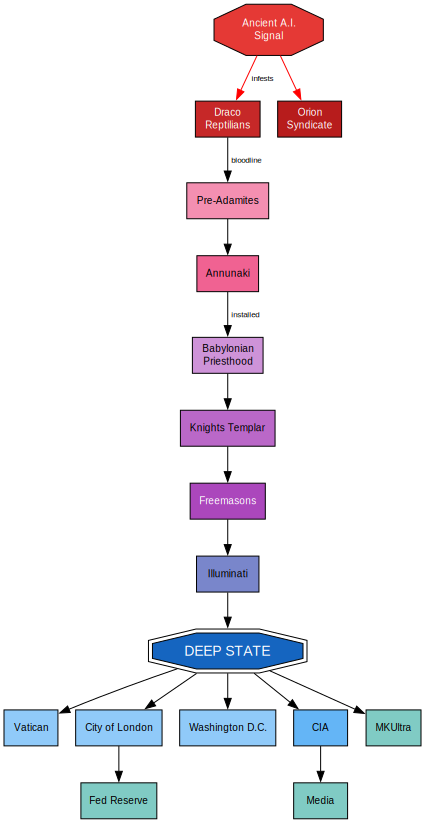

# Great Awakening Map -- Research Notes

A factual overview of 16 topics commonly found on the "Great Awakening Map," a QAnon-affiliated conspiracy diagram. Each section separates verified history from conspiracy claims and provides source links.

---

## 1. Cabal / Deep State / Illuminati

### Actual History

The **Bavarian Illuminati** was a real Enlightenment-era secret society founded on May 1, 1776, by Adam Weishaupt, a professor of law at the University of Ingolstadt in Bavaria. The society aimed to promote Enlightenment values -- opposing superstition, religious influence over public life, and abuses of state power. It was organized along Jesuit lines with influence from Freemasonry and may have grown to around 600 members by 1782. The Bavarian government banned the order in 1784 after intercepting writings deemed seditious, and it was effectively dissolved by 1787.

The term "deep state" has a legitimate academic origin. Political scientists have used it to describe entrenched bureaucratic networks that persist across changing administrations, particularly in countries like Turkey and Egypt. In the United States, it has been used more loosely to describe the permanent national security apparatus (intelligence agencies, military, etc.) that operates with some degree of independence from elected officials.

### Conspiracy Theory Version

In conspiracy culture, these three concepts -- Cabal, Deep State, and Illuminati -- are merged into a single narrative: a secret global elite controls governments, finance, and media from the shadows. The "Great Awakening Map" and QAnon mythology posit that this cabal includes Democratic politicians, Hollywood celebrities, and wealthy elites who are Satan-worshipping pedophiles, and that Donald Trump is fighting to expose and dismantle them.

The term "cabal" itself derives from the word *kabbalah* (a school of Jewish mysticism), and the concept of a secret global cabal has [deeply anti-Semitic roots](https://doctorparadox.net/dictionaries/authoritarianism/global-cabal/), even when individual proponents are unaware of this lineage. Preoccupation with shadowy conspiracies involving Jesuits, Freemasons, Illuminati, and Communists has animated American conspiratorial thinking for centuries.

**Sources:**
- [Britannica -- Bavarian Illuminati](https://www.britannica.com/topic/Bavarian-illuminati)
- [National Geographic -- Meet the Man Who Started the Illuminati](https://www.nationalgeographic.com/history/history-magazine/article/profile-adam-weishaupt-illuminati-secret-society)
- [Wikipedia -- Deep State Conspiracy Theory in the United States](https://en.wikipedia.org/wiki/Deep_state_in_the_United_States)
- [Britannica -- QAnon](https://www.britannica.com/topic/QAnon)
- [Doctor Paradox -- Global Cabal](https://doctorparadox.net/dictionaries/authoritarianism/global-cabal/)

---

## 2. Knights Templar

### Actual History

The Knights Templar (officially the Poor Fellow-Soldiers of Christ and of the Temple of Solomon) were formed on Christmas Day 1119, when Baldwin II, King of Jerusalem, persuaded a group of French knights led by Hugh de Payns to protect Christian pilgrims traveling through the Holy Land. These warrior-monks took vows of poverty and chastity but carried arms. Over the next two centuries, the Templars became enormously wealthy and powerful, operating an early form of international banking across Europe and the Levant.

After the fall of Acre in 1291 ended the Crusades, the order lost its military purpose. In 1307, King Philip IV of France -- heavily indebted to the Templars -- ordered the mass arrest of Templars in France, accusing them of heresy, blasphemy, and sodomy. Under torture, many confessed. Pope Clement V formally dissolved the order in 1312. Their last Grand Master, Jacques de Molay, was burned at the stake in 1314.

### Conspiracy Connections

The Templars' dramatic downfall, combined with sparse and ambiguous historical records, has made them a magnet for conspiracy theories for over 700 years:

- **Holy Grail Guardians**: One widespread legend claims the Templars discovered the Holy Grail (or the Ark of the Covenant) beneath the ruins of Solomon's Temple in Jerusalem and secretly guarded it.
- **Freemasonry Link**: In the 18th century, Andrew Ramsay, a senior French Freemason, first claimed a connection between Freemasonry and the Crusader knights. This was largely a marketing effort to appeal to the aristocracy. Masonic authorities themselves reject a direct historical link to the medieval Templars.
- **Lost Treasure**: Rumors persist that the Templars, forewarned of Philip IV's arrests, smuggled their treasure out of France on ships sailing from La Rochelle, with some theories placing it in Scotland, Switzerland, or even the Americas.
- **Surviving Secret Society**: The "Great Awakening Map" narrative often claims the Templars survived underground and evolved into or merged with the Freemasons, Illuminati, or banking dynasties.

**Sources:**
- [The Conversation -- Knights Templar: Still Loved by Conspiracy Theorists 900 Years On](https://theconversation.com/knights-templar-still-loved-by-conspiracy-theorists-900-years-on-128582)
- [Medieval Chronicles -- Top 10 Knights Templar Conspiracies](https://www.medievalchronicles.com/the-crusades/top-10-conspiracies-about-the-knights-templar/)
- [Christian Today -- The Knights Templar: History, Myth, Conspiracy](https://www.christiantoday.com/news/the-knights-templar-history-myth-conspiracy)
- [Pembroke College Cambridge -- Fake News, Medieval Style](https://www.pem.cam.ac.uk/kit-smarts-blog/fake-news-medieval-style-truth-about-templars)

---

## 3. Freemasons / 33rd Degree

### Actual History

Freemasonry is a fraternal organization that traces its origins to the local fraternities of stonemasons in the late Middle Ages. The first Grand Lodge was founded in London in 1717. Freemasonry uses allegorical rituals based on stonemasonry tools and the building of Solomon's Temple to teach moral and philosophical lessons.

The **Scottish Rite** is one of several appendant bodies of Freemasonry, and its degree system goes up to the 33rd degree. The 33rd degree (Inspector General Honorary) is an honorary degree bestowed for exceptional service to Freemasonry or the community. It does not confer secret power -- it is an honor, similar to an honorary doctorate.

Several American Founding Fathers were Freemasons, including George Washington, Benjamin Franklin, and James Monroe, which has contributed to a long tradition of speculation about Masonic influence on American institutions.

### Conspiracy Theories

Masonic conspiracy theories generally fall into three categories:

- **Political**: Allegations that Masons secretly control governments, particularly the U.S. and U.K. The appearance of symbols like the Eye of Providence on the U.S. dollar bill is cited as evidence, though historians attribute this to broader Enlightenment symbolism.
- **Religious**: Claims, particularly from conservative Protestants, that higher-degree Masons practice an occult or Satanic religion concealed from lower-degree members.
- **New World Order**: The theory that Freemasonry is a vehicle for a shadowy elite (sometimes merged with the Illuminati and/or Jewish bankers) to establish a totalitarian world government.

In the "Great Awakening Map" framework, the 33rd-degree Masons are portrayed as the innermost circle of a global conspiracy, aware of hidden truths concealed from lower-ranking members and the public.

**Sources:**
- [Wikipedia -- Masonic Conspiracy Theories](https://en.wikipedia.org/wiki/Masonic_conspiracy_theories)
- [National Geographic -- What's the Real History of the Freemasons?](https://www.nationalgeographic.com/history/article/freemasons-history-conspiracy-secret)
- [Explore the Archive -- The History of Freemasonry](https://explorethearchive.com/what-is-freemasonry)
- [CBS News -- 9 Things You Didn't Know About Freemasonry](https://www.cbsnews.com/news/9-things-you-didnt-know-about-freemasonry/)

---

## 4. Pizzagate

### Origin

Pizzagate originated in late 2016 from the WikiLeaks publication of John Podesta's hacked personal emails. Anonymous users on 4chan speculated that mundane words in the emails -- such as "pizza" and "cheese" -- were coded references to child sexual abuse. An "evidence" document uploaded to Reddit pulled threadbare inferences from innocent phrases and connected them to Comet Ping Pong, a pizza restaurant in Washington, D.C., owned by James Alefantis.

The conspiracy theory falsely claimed that high-ranking Democratic Party officials, including Hillary Clinton, were operating a child sex trafficking ring out of the restaurant's basement. Comet Ping Pong does not have a basement.

### Debunking

The theory has been extensively debunked by virtually every major news organization and fact-checking outlet, including The New York Times, The Washington Post, Snopes, Fox News, CNN, the Los Angeles Times, and the Miami Herald. Investigations found:

- No evidence of any criminal activity at Comet Ping Pong.
- Much of the "evidence" cited by proponents was taken from entirely unrelated sources.
- Images of children of family and friends of the restaurant's staff were stolen from social media and falsely claimed to be photos of trafficking victims.

### Real-World Consequences

On December 4, 2016, Edgar Maddison Welch of North Carolina traveled to Comet Ping Pong with an AR-15 rifle and fired it inside the restaurant during a self-described "investigation." No one was hurt. The restaurant's owner and staff received numerous death threats. Pizzagate is widely considered a precursor to the broader QAnon conspiracy theory.

**Sources:**
- [Wikipedia -- Pizzagate Conspiracy Theory](https://en.wikipedia.org/wiki/Pizzagate_conspiracy_theory)
- [Britannica -- Pizzagate](https://www.britannica.com/topic/Pizzagate)
- [Rolling Stone -- Pizzagate: Anatomy of a Fake News Scandal](https://www.rollingstone.com/feature/anatomy-of-a-fake-news-scandal-125877/)
- [Technology Science -- Investigating the Infamous Pizzagate Conspiracy Theory](https://techscience.org/a/2019121802/)

---

## 5. Adrenochrome

### The Actual Substance

Adrenochrome is a real chemical compound (C9H9NO3) produced by the oxidation of adrenaline (epinephrine). It is a rather unremarkable substance with no proven psychoactive or rejuvenating properties. Key facts:

- It has been synthesized in laboratories since at least 1952.
- It is commercially available and sold by biotechnology companies for research purposes.
- It is not a controlled substance.
- Its derivative, carbazochrome, is used as a hemostatic (blood-clotting) medication.
- It has no currently proven anti-aging or mind-altering applications.

### The Conspiracy Theory

QAnon and related conspiracy theories claim that a global cabal of elites kidnaps children and harvests adrenochrome from their blood, either as a recreational drug or as an "elixir of youth." The theory asserts the substance must be extracted from living, terrified children to be potent.

### Origins of the Myth

The mythologizing of adrenochrome can be traced to two main sources:

1. **Aldous Huxley** mentioned it briefly in *The Doors of Perception* (1954) in connection with possible psychoactive effects, though this was speculative.
2. **Hunter S. Thompson** fictionalized it in *Fear and Loathing in Las Vegas* (1971), where a character claims it must come from "the adrenaline glands from a living human body." Director Terry Gilliam later confirmed in DVD commentary that this portrayal was fictional exaggeration.

The conspiracy version ignores the fact that adrenochrome is cheaply and easily synthesized in any lab, making harvesting from humans both unnecessary and nonsensical.

**Sources:**
- [McGill University -- QAnon's Adrenochrome Quackery](https://www.mcgill.ca/oss/article/pseudoscience/qanons-adrenochrome-quackery)
- [Britannica -- Adrenochrome](https://www.britannica.com/science/adrenochrome)
- [American Chemical Society -- Adrenochrome](https://www.acs.org/molecule-of-the-week/archive/a/adrenochrome.html)
- [HowStuffWorks -- Untangling the Conspiracy Theories Around Adrenochrome](https://science.howstuffworks.com/adrenochrome.htm)

---

## 6. Epstein Island (Jeffrey Epstein Case)

### Documented Facts

Jeffrey Epstein was an American financier and convicted sex offender. In 1998, he purchased Little Saint James, a roughly 70-acre private island in the U.S. Virgin Islands, for $8 million. The key facts of his case:

- **2008**: Epstein pleaded guilty in Florida to state charges of soliciting a minor for prostitution and served 13 months under a widely criticized plea deal arranged by then-U.S. Attorney Alexander Acosta.
- **July 6, 2019**: Epstein was arrested in New York on federal charges of sex trafficking of minors.
- **August 10, 2019**: Epstein was found dead in his cell at the Metropolitan Correctional Center in Manhattan. The New York City medical examiner ruled his death a suicide by hanging.
- **2022**: Epstein's estate settled with the U.S. Virgin Islands government for over $100 million. The islands were sold for about $60 million.

### Connections to Powerful Figures

Court documents, flight logs, and contact books revealed connections between Epstein and numerous prominent figures, including former Presidents Bill Clinton and Donald Trump, Prince Andrew, former Israeli PM Ehud Barak, attorney Alan Dershowitz, and others. Clinton's name appeared on at least 17 flight legs on Epstein's private jet (often called the "Lolita Express").

Being named in these documents does not by itself constitute evidence of criminal wrongdoing. Most named individuals have denied any knowledge of Epstein's crimes.

### What Was Proven vs. Conspiracy Claims

The U.S. DOJ released a memo in July 2025 concluding that no "client list" existed in the Epstein files, that no credible evidence supported claims Epstein had systematically blackmailed prominent individuals, and that his death was a suicide. However, Epstein's associate Ghislaine Maxwell was convicted in December 2021 on five of six charges of sex trafficking and conspiracy.

Conspiracy theories -- particularly the claim "Epstein didn't kill himself" -- remain widespread. While legitimate questions exist about the security failures that allowed his death (broken cameras, sleeping guards), the formal investigation concluded suicide.

**Sources:**
- [Britannica -- Jeffrey Epstein](https://www.britannica.com/biography/Jeffrey-Epstein)
- [PBS -- Timeline of the Jeffrey Epstein Investigation](https://www.pbs.org/newshour/politics/a-timeline-of-the-jeffrey-epstein-investigation-and-the-fight-to-make-the-governments-files-public)
- [NPR -- Court Documents Reveal Names](https://www.npr.org/2024/01/03/1222130537/jeffrey-epstein-court-records-reveal-men-clinton-prince-andrew)
- [Wikipedia -- Epstein Files](https://en.wikipedia.org/wiki/Epstein_files)
- [Wikipedia -- Death of Jeffrey Epstein](https://en.wikipedia.org/wiki/Death_of_Jeffrey_Epstein)

---

## 7. MKUltra

### Documented History

MKUltra is not a conspiracy theory -- it is a confirmed, declassified CIA program. It is one of the most extensively documented cases of government abuse in American history.

- **Founded**: April 1953 by CIA Director Allen Dulles, under the supervision of chemist Sidney Gottlieb.
- **Purpose**: To develop techniques for mind control, interrogation, and behavior modification during the Cold War, partly in response to fears that the Soviets and Chinese had developed brainwashing capabilities.
- **Scope**: The program ultimately encompassed 149 sub-projects across 80 institutions, including universities, hospitals, and prisons.
- **Methods**: Experiments involved LSD and other drugs, electroshock therapy, hypnosis, sensory deprivation, isolation, verbal and sexual abuse, and other forms of torture -- often administered to unwitting subjects.

### Key Events

- **1953**: CIA officer Frank Olson fell to his death from a 10th-floor hotel window after being secretly dosed with LSD. His death was ruled a suicide, though his family has long contested this.
- **1964**: By the early 1960s, Dulles and Gottlieb concluded that reliable mind control was not achievable, and the program was wound down.
- **1973**: CIA Director Richard Helms ordered the destruction of all MKUltra files. Gottlieb personally oversaw the shredding of seven boxes of records.
- **1977**: A Freedom of Information Act request uncovered approximately 20,000 surviving documents (misfiled financial records), leading to Senate hearings chaired by Senator Frank Church and later Senator Ted Kennedy.

### Subproject 68

One of the most notorious sub-programs was conducted at the Allan Memorial Institute in Montreal by psychiatrist Dr. Donald Ewen Cameron. His experiments in "psychic driving" and "depatterning" involved extreme electroshock, drug-induced comas lasting weeks, and forced repetitive listening to recorded messages -- causing permanent damage to patients.

### Legacy

Declassified documents confirm that MKUltra techniques "contributed decisively to the development of techniques that Americans and their allies used at detention centers in Vietnam, Latin America, Afghanistan, Iraq, Guantanamo Bay, and secret prisons around the world."

**Sources:**
- [Wikipedia -- MKUltra](https://en.wikipedia.org/wiki/MKUltra)
- [HISTORY Channel -- The CIA's Appalling Human Experiments With Mind Control](https://www.history.com/mkultra-operation-midnight-climax-cia-lsd-experiments)
- [Britannica -- MK-Ultra](https://www.britannica.com/topic/MK-ULTRA)
- [National Security Archive -- CIA Behavior Control Experiments](https://nsarchive.gwu.edu/briefing-book/dnsa-intelligence/2024-12-23/cia-behavior-control-experiments-focus-new-scholarly)
- [U.S. Senate -- Project MKUltra Hearing Report](https://www.intelligence.senate.gov/wp-content/uploads/2024/08/sites-default-files-hearings-95mkultra.pdf)

---

## 8. Khazars / Khazarian Mafia

### Actual History

The **Khazar Khaganate** was a real Turkic empire that dominated much of the Pontic-Caspian steppe from the 7th to the 10th century. Some medieval sources describe the Khazar ruling class as having adopted Judaism, though modern scholarship disputes the scope of any mass conversion. The Khazar state collapsed by the 11th century.

The "Khazar hypothesis" -- the idea that Ashkenazi Jews are primarily descended from converted Khazars rather than from ancient Israelites -- was popularized by Arthur Koestler in his 1976 book *The Thirteenth Tribe*. Modern genetic studies have largely rejected this hypothesis, finding that Ashkenazi Jews share significant Middle Eastern ancestry.

### The Conspiracy Theory

The "Khazarian Mafia" conspiracy theory alleges that a clandestine cabal of "fake Jews" -- supposedly descended from the Khazars -- secretly controls global finance, media, and politics. The phrase was popularized by Mike Harris, a writer affiliated with Veterans Today, and has circulated widely on fringe media since the 2010s.

The theory essentially rebrands classic anti-Semitic tropes (the *Protocols of the Elders of Zion*, blood libel, global Jewish conspiracy) with a new label. By calling the alleged conspirators "Khazarian" rather than "Jewish," proponents claim they are not being anti-Semitic -- a framing that the Anti-Defamation League and scholars have firmly rejected.

The conspiracy gained additional traction during the 2022 Russian invasion of Ukraine, where it was used to justify Russian aggression by framing the Ukrainian government (and Jews broadly) as part of this "Khazarian" plot.

### Scholarly Assessment

The leap from the medieval Khazar Khaganate to a modern "Khazarian Mafia" is unsupported by archives, genetic evidence, or reputable historical methods. It functions as a conspiratorial and anti-Semitic meme amplified online by extremist actors.

**Sources:**
- [Wikipedia -- Khazarian Mafia](https://en.wikipedia.org/wiki/Khazarian_Mafia)
- [Institute for Strategic Dialogue -- Antisemitic Conspiracy Theory on Telegram](https://www.isdglobal.org/digital-dispatch/an-antisemitic-conspiracy-theory-is-being-shared-on-telegram-to-justify-russias-invasion-of-ukraine/)
- [ADL -- Antisemitic Conspiracy Theories Around Russian Assault on Ukraine](https://www.adl.org/resources/article/antisemitic-conspiracy-theories-abound-around-russian-assault-ukraine)
- [Conspiracy Watch -- Khazars](https://www.conspiracywatch.info/en/brieffing_notes/khazars/)

---

## 9. Vatican Conspiracy Theories

### The Vatican Apostolic Archive (formerly "Secret Archive")

The Vatican Apostolic Archive (renamed from "Vatican Secret Archive" in 2019 by Pope Francis) contains an estimated 85 kilometers (53 miles) of shelving with documents accumulated over centuries. The word "secret" in the original name came from the Latin *secretum*, meaning "private" or "personal" -- it was the Pope's personal archive, not a repository of hidden forbidden knowledge.

Since 1881, when Pope Leo XIII opened the archive to researchers, over a thousand scholars per year have examined its documents. Notable contents include Henry VIII's request for a marriage annulment, the trial transcript of Galileo, and letters from Michelangelo complaining about payment for the Sistine Chapel. Access requires a research degree and a valid scholarly reason, similar to any major research archive.

### The L.U.C.I.F.E.R. Telescope

One persistent conspiracy theory claims the Vatican operates a telescope called "LUCIFER" to search for aliens or an extraterrestrial savior. The reality:

- **L.U.C.I.F.E.R.** stood for "Large Binocular Telescope Near-infrared Utility with Camera and Integral Field Unit for Extragalactic Research" -- an instrument attached to the Large Binocular Telescope (LBT) on Mount Graham, Arizona.
- The Vatican Observatory does operate the Vatican Advanced Technology Telescope (VATT) on the same mountain, but it is a completely separate instrument operated by a different institution.
- The Vatican Observatory is not one of the owners of the LBT or the LUCIFER instrument.
- After the conspiracy theory spread, the instrument was renamed "LUCI" in 2012.

### Other Vatican Conspiracy Claims

- The Vatican Library supposedly hides books proving alien life, alternative Christian history, or suppressed gospels.
- Claims that the Vatican controls world politics through the Jesuits and Opus Dei.
- Theories that Vatican architecture encodes pagan or occult symbolism.

None of these claims are supported by evidence.

**Sources:**
- [Skeptoid -- The LUCIFER Telescope Conspiracy](https://skeptoid.com/episodes/729)
- [PolitiFact -- Vatican Doesn't Own a Telescope Called LUCIFER](https://www.politifact.com/factchecks/2021/nov/22/facebook-posts/no-vatican-doesnt-own-telescope-called-lucifer/)
- [Catholic Stand -- Conspiracies & Catholicism: Lucifer and the Vatican](https://catholicstand.com/conspiracies-catholicism-lucifer-vatican/)
- [The Public Medievalist -- The Truth of the Vatican Secret Archives](https://publicmedievalist.com/vatican-secret-archives/)
- [Wikipedia -- Vatican Apostolic Archive](https://en.wikipedia.org/wiki/Vatican_Apostolic_Archive)

---

## 10. Jesuits

### Actual History

The Society of Jesus (Jesuits) was founded in 1540 by Ignatius of Loyola and became one of the most influential religious orders in the Catholic Church. The Jesuits established a vast global network of schools, universities, and missions. They were known for rigorous intellectual training and were active in science, education, and diplomacy.

Their influence generated real political opposition:

- They were expelled from various countries, including Portugal (1759), France (1764), and Spain (1767).
- Pope Clement XIV suppressed the entire order in 1773 under pressure from European monarchs. It was restored by Pope Pius VII in 1814.
- Otto von Bismarck's Kulturkampf in Germany included the Jesuit Law of 1872, which expelled Jesuits from the German Empire.

### Conspiracy Theories

Jesuit conspiracy theories date back to at least 1550, just a decade after the order's founding. Major conspiracy claims include:

- **Political Assassinations**: Jesuits were accused of involvement in the assassination of William the Silent (1584), Henry III of France (1589), and Henry IV of France (1610).
- **Secret World Domination**: 19th-century writers like Jules Michelet, Edgar Quinet, and novelist Eugene Sue depicted the Jesuits as a "secret society bent on world domination by all available means."
- **Modern Claims**: In contemporary conspiracy culture, Jesuits are accused of assassinating Abraham Lincoln, John F. Kennedy, and multiple popes; controlling the Illuminati and Freemasons from behind the scenes; and working to bring about apocalyptic end-times scenarios.
- **"Black Pope"**: The Superior General of the Jesuits is sometimes called the "Black Pope" (due to his black cassock), which conspiracy theorists interpret as evidence that the Jesuit leader secretly controls the Vatican.

**Sources:**
- [Wikipedia -- Jesuit Conspiracy Theories](https://en.wikipedia.org/wiki/Jesuit_conspiracy_theories)
- [America Magazine -- The Uncomfortable Truths Behind Crazy Jesuit Conspiracy Theories](https://www.americamagazine.org/arts-culture/2022/06/14/jesuit-conspiracy-theory-great-replacement-243137/)
- [Journal of Jesuit Studies -- Jesuits, Conspiracies, and Conspiracy Theories](https://brill.com/view/journals/jjs/10/1/article-p15_003.xml?language=en)
- [Victorian Web -- Rumors of Jesuit Conspiracies](https://victorianweb.org/religion/jesuits.html)

---

## 11. Babylonian Money Magic / Debt Slavery Theory

### The Conspiracy Theory

"Babylonian Money Magic" is a conspiracy narrative claiming that the modern debt-based monetary system was invented in ancient Babylon around 600 BCE by "money changers" who discovered they could lend out more receipts for gold than they actually held -- the earliest form of fractional-reserve banking. The theory asserts:

- This secret knowledge was passed down through the centuries via a chain of secret societies: from Babylonian priests to the Knights Templar to the "Khazarian Mafia" to the Rothschild banking dynasty.
- Modern central banking (particularly the Federal Reserve) is a direct continuation of this ancient system of "money magic."
- Fiat currency and fractional-reserve banking constitute a form of enslavement, as debt creates an inescapable cycle of control.
- The entire global financial system is designed to extract wealth from ordinary people and funnel it to a ruling elite.

### What Is Real vs. What Is Not

There are kernels of legitimate observation buried in the theory:

- Ancient Babylon did develop sophisticated financial instruments, including contracts, interest-bearing loans, and debt records on clay tablets.
- Fractional-reserve banking is real and is the basis of modern banking.
- Debt and monetary policy are genuinely complex systems that can create inequality.

However, the conspiracy version wraps these facts in an unfounded narrative of deliberate, continuous, millennia-old manipulation by a single secret group. There is no historical evidence for a continuous chain of "money magic" knowledge from Babylon to modern banking families. The theory also frequently intersects with anti-Semitic tropes about Jewish bankers controlling the world.

**Sources:**
- [Ascension Glossary -- Babylonian Money Magic](https://ascensionglossary.com/index.php/Babylonian_Money_Magic)
- [Wikipedia -- Babylonian Law](https://en.wikipedia.org/wiki/Babylonian_law)
- [The Final Wakeup Call -- The Babylonian Money Changers](https://finalwakeupcall.info/en/2018/05/09/the-babylonian-money-changers/)

---

## 12. Club 33

### Actual Facts

Club 33 is a real, exclusive private club operated by The Walt Disney Company. It is not a conspiracy -- it is a well-documented, if secretive, members-only establishment.

- **Opened**: 1967, inside Disneyland in Anaheim, California.
- **Location**: 33 Royal Street, New Orleans Square, above the Pirates of the Caribbean ride and adjacent to one of Walt Disney's in-park apartments.
- **Origin**: Walt Disney conceived it after observing VIP lounges at corporate sponsor attractions during the 1964-1965 New York World's Fair. It was originally intended to host Disneyland's corporate sponsors.
- **Name**: Disney states it is simply named after its address, 33 Royal Street. No connection to Masonic degrees has been confirmed by the company.
- **Notable Feature**: When it opened, it was the only location within Disneyland that served alcoholic beverages.
- **Membership**: Extremely expensive and exclusive. Memberships reportedly have years-long waiting lists and cost tens of thousands of dollars in initiation fees plus annual dues.
- **Expansion**: Additional Club 33 locations now exist at Walt Disney World (all four parks), Tokyo Disneyland, and Shanghai Disneyland.

### Conspiracy Connection

In "Great Awakening Map" circles, Club 33 is cited as evidence of secret elite societies operating in plain sight, with the number 33 linked to the 33rd degree of Freemasonry. There is no verified evidence connecting Club 33 to Freemasonry, the Illuminati, or any secret society.

**Sources:**
- [Wikipedia -- Club 33](https://en.wikipedia.org/wiki/Club_33)
- [WDW Magazine -- What is Club 33?](https://www.wdw-magazine.com/what-is-club-33-inside-disneys-most-exclusive-club/)
- [Disney Tourist Blog -- History of Club 33 at Disneyland](https://www.disneytouristblog.com/club-33-disneyland-photos-history-review/)

---

## 13. Washington D.C. / City of London / Vatican City -- "Three City-States" Theory

### The Conspiracy Theory

This theory claims that three "independent city-states" -- Washington D.C., the City of London, and Vatican City -- form an "Empire of the City" that secretly rules the world. Each allegedly controls one domain:

- **City of London**: Controls global finance and law.
- **Vatican City**: Controls religion and spiritual matters.
- **Washington D.C.**: Controls the military.

The theory often asserts that the Act of 1871 transformed the United States into a corporation (sometimes styled "THE UNITED STATES" in capital letters) controlled by this trinity. Proponents claim the D.C. flag's three red stars each represent one city-state in the empire.

### Fact-Check

- **Washington D.C.** is not an independent city-state. It is a federal district under the authority of the U.S. Congress, established by the Residence Act of 1790.
- **The City of London** is a historic financial district within Greater London with its own governance structure (the City of London Corporation), but it is subject to UK law and Parliament. It is not an independent sovereign entity.
- **Vatican City** is genuinely an independent city-state (since the 1929 Lateran Treaty), but its sovereignty extends only to its 44 hectares.
- **The Act of 1871** (District of Columbia Organic Act) created a municipal government for D.C. It did not turn the United States into a corporation.
- **The D.C. flag** is based on the coat of arms of George Washington's family, not on any "three city-states" symbolism.

PolitiFact rated claims about this interconnected empire as unsubstantiated.

**Sources:**
- [PolitiFact -- D.C. Flag Conspiracy Debunked](https://www.politifact.com/factchecks/2023/may/03/facebook-posts/district-of-columbia-flag-is-based-on-washington-f/)

---

## 14. CERN

### Actual Science

CERN (the European Organization for Nuclear Research) is an intergovernmental research organization operating the world's largest particle physics laboratory, located on the Franco-Swiss border near Geneva, Switzerland. Its flagship instrument is the **Large Hadron Collider (LHC)**:

- A 27-kilometer (17-mile) ring of superconducting magnets buried 100 meters underground.
- Accelerates protons or heavy ions to near the speed of light and collides them at four detector sites (ATLAS, CMS, ALICE, LHCb).
- In July 2012, CERN announced the discovery of the **Higgs boson**, confirming the Brout-Englert-Higgs mechanism that explains how fundamental particles acquire mass. This was a landmark achievement in physics.
- CERN also invented the World Wide Web in 1989 (by Tim Berners-Lee) as a tool for sharing data among physicists.

### Conspiracy Theories

Despite (or because of) its cutting-edge science, CERN has attracted numerous conspiracy theories:

- **Opening Portals to Hell / Other Dimensions**: Claims that the LHC is being used to open portals to hell, other dimensions, or to summon demonic entities. These often reference the LHC's ability to probe conditions similar to those shortly after the Big Bang.
- **Creating Black Holes**: Fears that collisions could create micro black holes that would consume the Earth. CERN's own safety assessments, and independent physics reviews, have concluded this is not possible -- any micro black holes produced would evaporate almost instantly via Hawking radiation.
- **The Shiva Statue**: CERN has a statue of Nataraja (the Hindu deity Shiva performing the cosmic dance), a gift from India in 2004. It symbolizes the dance of creation and destruction of subatomic particles. Conspiracy theorists claim it proves CERN is engaged in occult practices.
- **The 2016 "Ritual" Video**: A viral video from August 2016 showed cloaked figures performing a mock human sacrifice in front of the Shiva statue on CERN's grounds. CERN confirmed the video showed a prank by scientists with access badges, called it "fiction," and said it violated CERN's professional guidelines. Nonetheless, the video continues to circulate as "proof" of satanic activity.

**Sources:**
- [CERN -- The Large Hadron Collider](https://home.cern/science/accelerators/large-hadron-collider)
- [Wikipedia -- CERN Ritual Hoax](https://en.wikipedia.org/wiki/CERN_ritual_hoax)
- [Science (AAAS) -- Prankster Scientists Perform Fake Human Sacrifice at CERN](https://www.science.org/content/article/prankster-scientists-perform-fake-human-sacrifice-cern)
- [Snopes -- Was a Human Sacrifice Captured at CERN?](https://www.snopes.com/fact-check/human-sacrifice-captured-at-cern/)
- [IFLScience -- Video of a Mock Occult Ritual at CERN](https://www.iflscience.com/video-of-a-mock-occult-ritual-at-cern-circulates-online-37486)

---

## 15. Sealed Indictments (QAnon Concept)

### The Claim

A core QAnon belief is that the U.S. Department of Justice has been secretly filing tens of thousands of sealed indictments against members of the "Deep State" -- Democratic politicians, Hollywood celebrities, and wealthy elites. When the time is right (an event called "The Storm"), these indictments will be unsealed, triggering a massive wave of arrests. The claimed number has grown over time, from approximately 4,000 in early QAnon posts to over 63,000 and eventually 200,000+.

### The Reality

The numbers cited by QAnon rely on a fundamental misunderstanding (or deliberate misrepresentation) of federal court records:

- Federal courts do produce sealed proceedings regularly. These include sealed motions, search warrants, surveillance requests, magistrate cases, and other routine court business -- not just indictments.
- The numbers QAnon believers cite are **sealed court proceedings**, not sealed indictments specifically.
- The numbers were not compared to previous years. When compared properly, the number of sealed proceedings per year has been relatively consistent.
- Despite years of predictions, none of these supposed mass indictments have been unsealed, and no mass arrests have occurred.

### Assessment

The "sealed indictments" narrative functions as an unfalsifiable prophecy within QAnon: the arrests are always coming "soon," and any delay is explained as part of "the plan." This perpetual anticipation is a key mechanism for maintaining belief in the conspiracy.

**Sources:**
- [Daily Dot -- Inside the 25,000 Sealed Indictments Fueling QAnon](https://www.dailydot.com/news/sealed-indictments-qanon-conspiracy/)
- [Daily Dot -- QAnon Sealed Indictments: Why the Number is Not 63,000](https://dailydot.com/qanon-sealed-indictments-63000)
- [ADL -- QAnon Backgrounder](https://www.adl.org/resources/backgrounder/qanon)

---

## 16. Tribunals (QAnon Military Tribunal Theory)

### The Claim

Closely linked to the sealed indictments narrative, QAnon adherents believe that members of the "Deep State cabal" will face **military tribunals** rather than civilian courts. The theory envisions:

- Arrested elites being sent to Guantanamo Bay for military trial.
- Tribunals resulting in convictions and executions.
- Specific claims that figures like Hillary Clinton, Barack Obama, John McCain, the Clintons, and others have already been secretly tried and executed, with body doubles or clones taking their place in public.
- One QAnon-affiliated site, QMap (run by a Citigroup employee), claimed John McCain was killed by a military tribunal.

### Legal Reality

- **Military tribunals** in the U.S. are governed by the Uniform Code of Military Justice and the Military Commissions Act. They are used to try enemy combatants and members of the military, not civilian political figures.
- U.S. citizens on U.S. soil have a constitutional right to trial by jury in civilian courts. Subjecting them to military tribunals would be unconstitutional outside of extremely narrow wartime circumstances.
- No evidence exists that any of the claimed tribunals have occurred.
- PolitiFact investigated and found no evidence that dozens of military tribunals were underway. Specific claims about tribunals for the Clintons, Colin Powell, and Hunter Biden were rated false.

### Assessment

The military tribunal theory represents the culmination of the QAnon narrative arc: the "Deep State" is exposed, arrested (via sealed indictments), and punished (via military tribunals). It has never materialized despite years of predictions, yet remains a central belief among QAnon adherents.

**Sources:**
- [PolitiFact -- No, Dozens of Military Tribunals Aren't Underway](https://api.politifact.com/factchecks/2021/jul/30/facebook-posts/no-dozens-military-tribunals-arent-underway/)
- [PolitiFact -- No, the Clintons et al. Didn't Have Military Tribunals](https://www.politifact.com/factchecks/2021/oct/26/facebook-posts/no-clintons-colin-powell-and-hunter-biden-didnt-ha/)
- [ADL -- QAnon Backgrounder](https://www.adl.org/resources/backgrounder/qanon)
- [Wikipedia -- QAnon](https://en.wikipedia.org/wiki/QAnon)
- [Newsweek -- Citigroup Worker Ran Popular QAnon Site](https://www.newsweek.com/qanon-citigroup-john-mccain-qmap-trump-1537092)

---

*Research compiled from web sources. Each section distinguishes verified facts from conspiracy claims. Inclusion of a topic does not constitute endorsement of any conspiracy theory.*
